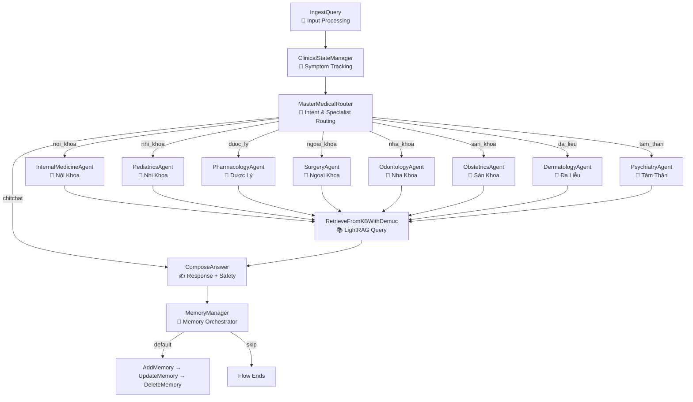

# Design Doc: Advanced Medical Agent Flow

## Overview

The **AdvancedMedicalFlow** is a 5-layer multi-agent system for medical consultations, powered by LightRAG (Graph + Vector RAG) and PocketFlow. It routes queries to **8 specialist agents** and includes a **safety disclaimer layer** for medication and sensitive content.

## Architecture



## Layer Design

### Layer 1: Cognitive Layer
**IngestQuery** → **ClinicalStateManager**

- Processes raw user input and conversation history
- ClinicalStateManager loads chat history from PostgreSQL
- Extracts symptoms via LLM, compares old vs new (added/removed/unchanged)
- Persists clinical state to `clinical_states` table

### Layer 2: Routing & Safety
**MasterMedicalRouter**

- Routes based on clinical state and intent
- 9 output routes: 8 specialists + `chitchat`
- Priority logic:
  1. Age < 16 → `nhi_khoa`
  2. Drug/dosing → `duoc_ly`
  3. Trauma/surgery → `ngoai_khoa`
  4. Dental/oral → `nha_khoa`
  5. Pregnancy/women's health → `san_khoa`
  6. Skin/allergy → `da_lieu`
  7. Mental health → `tam_than`
  8. Default → `noi_khoa`

### Layer 3: Execution Layer
**Specialist Agents** → **RetrieveFromKBWithDemuc**

- Each specialist rewrites the query with domain-specific context
- Optimized query is sent to LightRAG (hybrid mode: graph + vector)
- Retrieved context stored in `shared["retrieved_context"]`

### Layer 4: Output Layer
**ComposeAnswer** (+ Safety Disclaimer)

- Generates medical response using LLM with specialist context
- Formats response with explanation, summary, and follow-up suggestions
- **Safety disclaimer** auto-appended when:
  - Response contains medication keywords (mg, thuốc, liều, kháng sinh, etc.)
  - Active specialist is Dược Lý, Tâm Thần, or Sản Khoa

### Layer 5: Memory Management
**MemoryManager** → **Add/Update/DeleteMemory**

- Manages long-term patient memory across conversations
- Operations: INSERT new facts, UPDATE existing, DELETE outdated

## Error Handling

| Component | Error Strategy |
|-----------|---------------|
| ClinicalStateManager | try-except on all DB calls; returns default state on failure |
| LightRAGEngine.initialize() | try-except; resets singleton on failure, re-raises |
| LightRAGEngine.query() | try-except; returns Vietnamese error message instead of crashing |
| ComposeAnswer | handles None exec_res; routes to FallbackNode on API overload |
| RetrieveFromKBWithDemuc | handles None exec_res; returns empty context on failure |

## Shared Store

```python
shared = {
    # Input
    "input": str,                     # Raw user input
    "role": str,                      # User role
    "thread_id": str,                 # Chat thread ID
    "conversation_history": list,     # Previous messages
    
    # Layer 1: Clinical State
    "clinical_state": {
        "profile": {"age", "gender", "history"},
        "symptoms": ["symptom1", "symptom2"],
        "current_condition": "...",
        "intent": "MEDICAL|CHITCHAT",
    },
    "symptom_changes": {
        "added": [], "removed": [], "unchanged": [],
        "has_changes": bool,
    },
    
    # Layer 2: Routing
    "intent": str,                    # MEDICAL or CHITCHAT
    "retrieval_query": str,           # Optimized query for LightRAG
    "routing_reason": str,            # Why this specialist was chosen
    
    # Layer 3: Specialist + Retrieval
    "specialist_context": {
        "specialist": str,
        "analysis": str,
        "extra": dict,
    },
    "retrieved_context": str,         # LightRAG retrieved content
    
    # Layer 4: Output
    "answer_obj": dict,               # Complete response
    "explain": str,                   # Main explanation (+ safety disclaimer if applicable)
    "suggestion_questions": list,     # Follow-up suggestions
}
```

## Utility Functions

| Utility | Module | Purpose |
|---------|--------|---------|
| `call_llm` | `utils/llm/call_llm.py` | LLM calls with retry and fast mode |
| `LightRAGEngine` | `utils/lightrag_engine.py` | LightRAG singleton with Gemini integration |
| `parse_json_from_llm` | `utils/parsing/response_parser.py` | JSON extraction from LLM responses |
| `compare_symptoms` | `core/nodes/ClinicalStateManager.py` | Old vs new symptom comparison |
| `load_chat_history_from_db` | `core/nodes/ClinicalStateManager.py` | PostgreSQL chat history loading |

## Database Tables

| Table | Purpose |
|-------|---------|
| `users` | User accounts |
| `chat_threads` | Conversation threads |
| `chat_messages` | Individual messages |
| `clinical_states` | Patient symptom tracking |
