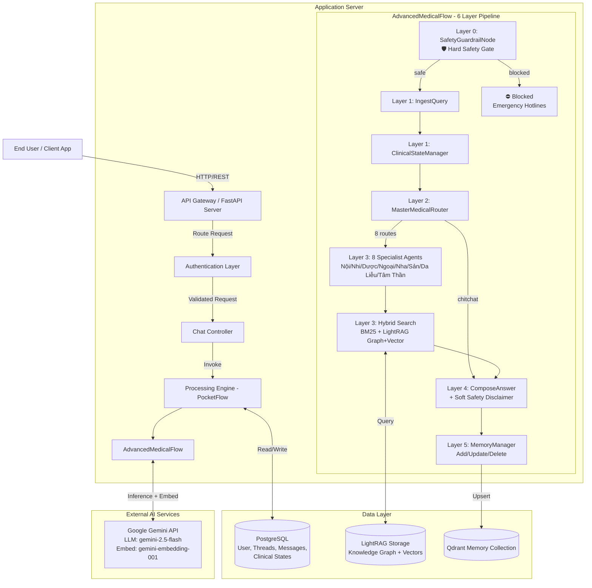

# 3.1. TỔNG QUAN KIẾN TRÚC HỆ THỐNG

Hệ thống **Medical Chatbot** được thiết kế dựa trên kiến trúc microservices đơn giản hóa (modular monolith), tập trung vào khả năng mở rộng, dễ bảo trì và tích hợp mạnh mẽ với các mô hình ngôn ngữ lớn (LLM) để xử lý hội thoại y tế. Hệ thống sử dụng kiến trúc 6 tầng (Layer 0–5) với **SafetyGuardrailNode** (bảo vệ an toàn), **8 chuyên khoa AI**, **Hybrid Search** (BM25 + Vector + Knowledge Graph) qua LightRAG, và phân tách rõ ràng giữa các tầng xử lý.

## 3.1.1. Mô hình tổng quan

### Sơ đồ kiến trúc tổng thể (High-level Architecture Diagram)

Dưới đây là sơ đồ kiến trúc mức cao của hệ thống, thể hiện sự tương tác giữa Người dùng, API Gateway, Engine xử lý chính và các thành phần dữ liệu/AI.

### Các tầng trong hệ thống

Hệ thống được tổ chức thành 3 tầng infrastructure chính, bên trong chứa pipeline 6 layer:

1.  **API Layer (Presentation/Interface Layer)**:
    *   **Nhiệm vụ**: Tiếp nhận các yêu cầu HTTP từ client, xác thực người dùng (Authentication), kiểm tra dữ liệu đầu vào (Validation) và điều hướng yêu cầu đến các service tương ứng.
    *   **Thành phần**: `FastAPI` router, Pydantic schemas, Middleware xử lý lỗi và logging.

2.  **Service/Flow Layer (Business Logic Layer)**:
    *   **Nhiệm vụ**: Chứa toàn bộ logic nghiệp vụ của ứng dụng. Sử dụng **PocketFlow** để quản lý luồng hội thoại dưới dạng đồ thị các node.
    *   **Thành phần**: `AdvancedMedicalFlow` — pipeline 6 layer:
        *   **Layer 0**: `SafetyGuardrailNode` — Chặn câu hỏi nguy hiểm (tự hại, đầu độc, lạm dụng thuốc)
        *   **Layer 1**: `IngestQuery` → `ClinicalStateManager` — Xử lý đầu vào, theo dõi triệu chứng
        *   **Layer 2**: `MasterMedicalRouter` — Phân tuyến đến 8 chuyên khoa hoặc chitchat
        *   **Layer 3**: 8 Specialist Agents → `RetrieveFromKBWithDemuc` — Hybrid Search (BM25 + LightRAG)
        *   **Layer 4**: `ComposeAnswer` — Sinh câu trả lời + disclaimer an toàn
        *   **Layer 5**: `MemoryManager` → Add/Update/Delete Memory

3.  **Data Layer (Persistence Layer)**:
    *   **Nhiệm vụ**: Lưu trữ dữ liệu bền vững, Knowledge Graph, và vector embeddings.
    *   **Thành phần**:
        *   **PostgreSQL**: Lưu trữ thông tin người dùng, lịch sử hội thoại (threads, messages), trạng thái lâm sàng (clinical_states).
        *   **LightRAG Storage**: Knowledge Graph (.graphml) + Vector embeddings — phục vụ Hybrid Search.
        *   **Qdrant**: Lưu trữ User Memory (bộ nhớ dài hạn người dùng).

### Luồng dữ liệu chính (Main Data Flow)

1.  **Request**: User gửi câu hỏi → API Gateway tiếp nhận → Xác thực qua JWT.
2.  **Safety Check (Layer 0)**: `SafetyGuardrailNode` phân loại tin nhắn: SAFE/WARN/BLOCK. Nếu BLOCK → trả về số hotline khẩn cấp, bỏ qua toàn bộ pipeline.
3.  **Clinical Tracking (Layer 1)**: `ClinicalStateManager` trích xuất triệu chứng, cập nhật hồ sơ bệnh án.
4.  **Routing (Layer 2)**: `MasterMedicalRouter` phân tuyến đến chuyên khoa phù hợp (1 trong 8).
5.  **Specialist + Retrieval (Layer 3)**: Specialist Agent viết lại query → Hybrid Search (BM25 + LightRAG Graph+Vector) truy xuất tài liệu y khoa.
6.  **Generation (Layer 4)**: `ComposeAnswer` tổng hợp thông tin và sinh câu trả lời. Tự động gắn disclaimer an toàn khi có nội dung thuốc/liều dùng.
7.  **Memory (Layer 5)**: `MemoryManager` lưu/cập nhật/xóa thông tin bệnh nhân.
8.  **Response**: API trả về câu trả lời cho User.

---

## 3.1.2. Các thành phần chính

### 1. API Gateway (FastAPI Server)
Là cổng giao tiếp duy nhất của hệ thống với thế giới bên ngoài.
*   **Chức năng**: Routing, Rate limiting, CORS handling, Request/Response validation.
*   **Đặc điểm**: Hiệu năng cao (Asynchronous), tự động sinh tài liệu (Swagger UI/OpenAPI).

### 2. Processing Engine (PocketFlow)
Trái tim của hệ thống chatbot, quản lý vòng đời của một yêu cầu hội thoại.
*   **PocketFlow**: Framework workflow tùy chỉnh giúp định nghĩa luồng xử lý dưới dạng Directed Acyclic Graph (DAG) hoặc Cyclic Graph.
*   **Nodes**: Các đơn vị xử lý nhỏ (Atomic units): `SafetyGuardrailNode` (bảo vệ an toàn), `MasterMedicalRouter` (phân tuyến), 8 Specialist Agents, `RetrieveFromKBWithDemuc` (Hybrid Search), `ComposeAnswer` (soạn thảo).
*   **Flows**: `AdvancedMedicalFlow` (pipeline 6 tầng chính với 8 chuyên khoa).

### 3. Data Storage
*   **PostgreSQL (Relational DB)**:
    *   Quản lý `Users`: Thông tin tài khoản, mật khẩu (hash).
    *   Quản lý `Threads`: Các cuộc hội thoại.
    *   Quản lý `ChatMessages`: Nội dung chi tiết từng tin nhắn.
*   **Qdrant (Vector DB)**:
    *   **Collections**: `bndtd` (Bệnh nhân đái tháo đường), `bsrhm` (Bác sĩ RHM), `user_memory` (Bộ nhớ người dùng).
    *   **Search**: Hỗ trợ tìm kiếm Semantic (Cosine Similarity) kết hợp từ khóa (BM25) và Reranking (ColBERT).

### 4. AI/ML Components
*   **LLM (Large Language Model)**: Sử dụng **Google Gemini** (`gemini-2.5-flash` thông qua `google-genai` SDK) làm bộ não chính cho việc hiểu ngôn ngữ, suy luận logic và sinh văn bản.
*   **Embedding Model**: `gemini-embedding-001` (Google) — tạo vector cho LightRAG Knowledge Graph.
*   **BM25 Index**: `rank-bm25` — keyword matching cho Hybrid Search.
*   **Memory Embedding Models** (Qdrant User Memory):
    *   Dense: `sentence-transformers/all-MiniLM-L6-v2` (tạo vector ngữ nghĩa).
    *   Sparse: `Qdrant/bm25` (tạo vector từ khóa).
    *   Late Interaction: `colbert-ir/colbertv2.0` (mô hình reranking độ chính xác cao).

### 5. Authentication
*   Sử dụng cơ chế **JWT (JSON Web Token)**.
*   **Flow**: User đăng nhập -> Server trả về Access Token -> Client gửi Token trong Header `Authorization: Bearer <token>` cho các request tiếp theo.

---

## 3.1.3. Công nghệ và framework

Bảng dưới đây tóm tắt các công nghệ lõi được sử dụng để xây dựng hệ thống:

| Thành phần | Công nghệ / Framework | Phiên bản (Ước tính) | Lý do lựa chọn |
| :--- | :--- | :--- | :--- |
| **Backend Language** | **Python** | 3.11+ | Hệ sinh thái AI/ML mạnh mẽ, cú pháp rõ ràng, hỗ trợ tốt cho xử lý bất đồng bộ. |
| **Web Framework** | **FastAPI** | 0.111.0 | Hiệu năng cao (Starlette), validate dữ liệu mạnh (Pydantic), hỗ trợ Async IO tối ưu cho AI services. |
| **Workflow Engine** | **PocketFlow** | 0.0.3 | Framework nội bộ/tùy chỉnh giúp linh hoạt trong việc thiết kế luồng hội thoại phức tạp (Stateful LLM flows). |
| **RAG Engine** | **LightRAG** (`lightrag-hku`) | Latest | Knowledge Graph + Vector retrieval, hỗ trợ đa dạng search mode (naive, local, global, hybrid). |
| **Hybrid Search** | **rank-bm25** | Latest | BM25 keyword matching kết hợp với LightRAG Graph+Vector cho Hybrid Search 3 chiều. |
| **Vector Database** | **Qdrant** | Latest (Docker) | Open-source, hiệu năng truy vấn vector cực nhanh, dùng cho User Memory. |
| **Relational DB** | **PostgreSQL** | 15-alpine | Cơ sở dữ liệu quan hệ mạnh mẽ, ổn định, chuẩn công nghiệp cho lưu trữ dữ liệu người dùng. |
| **LLM Provider** | **Google GenAI** | Latest | Tích hợp mô hình Gemini (`gemini-2.5-flash`): chi phí hợp lý, context window lớn, suy luận tốt tiếng Việt. |
| **Embedding** | **gemini-embedding-001** | Latest | Google embedding model cho LightRAG Knowledge Graph. |
| **Containerization** | **Docker & Compose** | - | Đóng gói môi trường nhất quán, dễ dàng triển khai và mở rộng (Microservices ready). |
| **ORM** | **SQLAlchemy** | Latest | Trừu tượng hóa thao tác với Database, an toàn và dễ bảo trì code. |

Hệ thống được thiết kế để chạy trên môi trường Container (Docker), đảm bảo tính nhất quán giữa môi trường phát triển (Development) và triển khai (Production).
